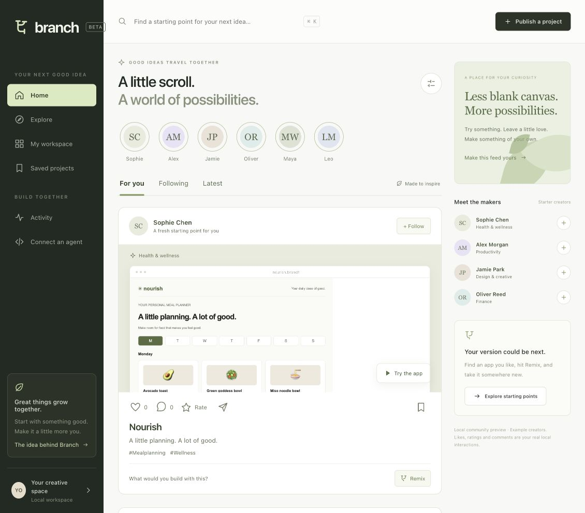
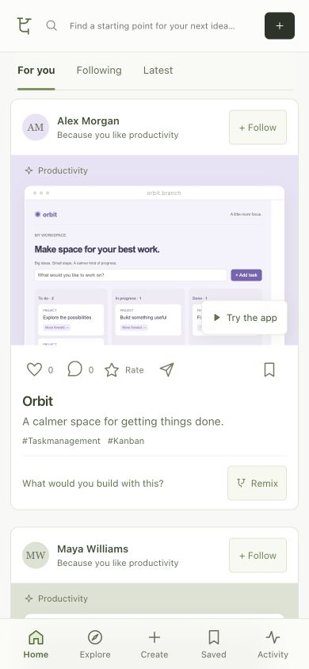

# Branch UX verification

Verified on 18 September 2026 using Computer Use in the Codex browser, the Node integration suite, and an Xcode simulator build.

## Completed checks

| Check | Result |
| --- | --- |
| Desktop feed | Visually inspected rendered project previews, creator rail and reaction controls. |
| Phone layout | Visually inspected at 390 × 844; document width matched viewport, with no horizontal overflow. Bottom navigation and comment composer stayed visible. |
| Likes, stars and comments | Liked Nourish, rated it five stars, posted a test comment, and reloaded. All three persisted. |
| Following | Followed Sophie Chen; Following showed only her published project. |
| Personalization | Selecting Productivity moved Orbit and Still ahead of other categories. |
| Saves | Saved Orbit, opened Saved, then removed it; collection immediately showed its empty state. |
| Feed continuity | Navigation away and back restored scrollY 794.5 exactly. Progressive loading produced six distinct projects and a caught-up footer. |
| Keyboard | ArrowRight moved from For you to Following, including selected state and focus. |
| Remix regression | Created a named test fork from the mobile feed, changed its heading, saved, and verified the new heading in the live preview. |
| API integration suite | `npm test`: 13 tests passed, including the parent suite. Covers social validation/persistence and the earlier editing, preview isolation and project lifecycle. |
| iOS compilation | Debug simulator build succeeded for iPhone 17 Pro, iOS 26.5. |
| iOS launch and data | Installed and launched Branch. Its generated cache contained six projects and the same like, five-star rating, comment count, follow and interests used by the browser. This verifies launch/network/model integration, not rendered UI. |

The test-only remix and social actions were removed after verification. Screenshots show intermediate test state.

## Screenshots

These are actual browser captures, not design mockups. The phone image is the responsive web app, not the native iOS app.

## Remaining checks and scope

Computer Use could not inspect or operate iOS Simulator because macOS reported the screen locked. Native screenshots, tap flows, keyboard layout and VoiceOver checks remain unverified. Unlock the Mac to finish those checks. Simulator launch and successful compilation do not substitute for them.

No live Ollama model was installed or downloaded for this verification; automated tests exercise model output and failures through a mock model server. Public accounts, multi-user moderation, public hosting, distributed compute and App Store delivery remain outside the implemented local prototype.

Functional verification does not establish improved retention or prove that the experience is engaging to real people. The pilot tasks and outcome measures in [UX research](../UX-RESEARCH.md) are the next validation step.
